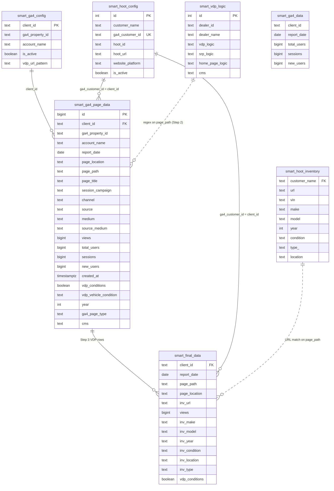
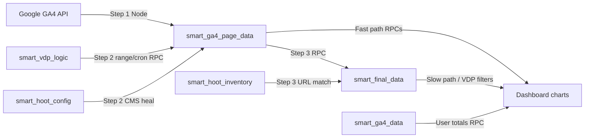

# SmartAnalytics — Knowledge Base

Technical reference for RPCs, data sources, pipeline steps, dashboard data flow, and XLSX exports.  
Last updated: May 2026 — `apply_vdp_filtration_range` (admin Step 2), VDP/All XLSX exports, overview resilience, compare table (MoM + YoY), channel groups, dealer/tab persistence, sign-out route.

### Contents

1. [Architecture overview](#1-architecture-overview)  
2. [Database tables](#2-database-tables-main)  
3. [Supabase RPC functions](#3-supabase-rpc-functions)  
4. [Admin pipeline](#4-admin-pipeline-3-steps)  
5. [Dashboard layout & tabs](#5-dashboard-page-layout--tabs)  
6. [Overview data flow](#6-overview-data-flow)  
7. [Compare period (MoM + YoY)](#7-compare-period-mom--yoy)  
8. [Channel grouping](#8-channel-grouping-rollup--dropdown)  
9. [API routes map](#9-api-routes-map)  
10. [Key frontend modules](#10-key-frontend-modules)  
11. [Caching](#11-caching)  
12. [Indexes & performance](#12-indexes--performance)  
13. [Deployment checklist](#13-deployment-checklist)  
14. [`p_days_back` examples](#14-quick-reference--p_days_back-examples)  
15. [Environment variables](#15-environment-variables)  
16. [Authentication & authorization](#16-authentication--authorization)  
17. [Entity-relationship model](#17-entity-relationship-model)  
18. [Related files index](#18-related-files-index)  
19. [XLSX exports (VDP + All tabs)](#19-xlsx-exports-vdp--all-tabs)  
20. [UI persistence (localStorage)](#20-ui-persistence-localstorage)

---

## 1. Architecture overview

```
GA4 API  ──► Step 1 (Node) ──► smart_ga4_page_data
                                      │
Admin Step 2: apply_vdp_filtration_range (exact From→To) ──┤  vdp_conditions, ga4_page_type, year, …
Cron Step 2: apply_vdp_filtration (p_days_back from today) ┘
                                      │
Step 3 RPC build_smart_final_data ───► smart_final_data  (inventory-enriched VDP rows)
                                      │
Dashboard RPCs ◄──────────────────────┘  reads page + final tables
```

**Client identity:** `client_id` in data tables = `smart_hoot_config.ga4_customer_id` (exposed in UI as `clientKey` / `ga4CustomerId`).

**Chunking:** Large date ranges are split into ~5-day windows via `src/lib/api/chunkedRpc.js` (`rpcByDateChunks`, `rpcByDateChunksProgressive`) to avoid Postgres statement timeouts.

---

## 2. Database tables (main)

| Table | Role |
|-------|------|
| `smart_ga4_page_data` | Page-grain GA4 facts after Step 1 sync. Includes `page_location`, `page_path`, `page_title`, `channel`, `source`, `medium`, `source_medium`, `session_campaign`, `views`, `total_users`, `sessions`, `new_users`, `report_date`, `vdp_conditions`, `ga4_page_type`, `vdp_vehicle_condition`, `year`, `cms`, `account_name`, `created_at`. |
| `smart_ga4_data` | Session/user totals (not page-grain). Used for unique visitors via `get_ga4_user_totals`. **Optional** — overview still loads if this table/RPC is missing. |
| `smart_final_data` | VDP rows matched to inventory (Hoot). Includes `inv_url`, `inv_make`, `inv_model`, `inv_location`, `inv_condition`, `page_location`, `hoot_url` (feed URL — **not** used for export URLs). |
| `smart_hoot_config` | Dealer config: `ga4_customer_id`, `account_name`, `website_platform`, etc. |
| `smart_vdp_logic` | Regex rules per dealer: `vdp_logic`, `srp_logic`, `home_page_logic`. Used by Step 2 filtration. |
| `smart_ga4_config` | GA4 property registry for Step 1 sync (`client_id`, `ga4_property_id`). |
| `smart_hoot_inventory` | Hoot inventory URLs/specs — joined in Step 3 for make/model/year on final rows. |

See **§17 Entity-relationship model** for joins and lifecycle diagrams.

## 3. Supabase RPC functions

SQL definitions live under `supabase/rpc/*.sql`. Deploy in Supabase SQL Editor when signatures change.

### 3.1 Admin pipeline

#### `apply_vdp_filtration_range(p_client_id, p_from, p_to)` — **Admin Step 2**

| Param | Meaning |
|-------|---------|
| `p_client_id` | GA4 customer ID (optional `NULL` = all dealers in range). Admin UI always passes a single dealer. |
| `p_from` / `p_to` | **Required.** Inclusive `report_date` window: `BETWEEN p_from AND p_to`. |

**What it does:** Same classification logic as `apply_vdp_filtration` — self-heals `cms` from Hoot; sets `vdp_conditions`, `ga4_page_type`, `vdp_vehicle_condition`, `year` using `smart_vdp_logic` regex on `page_path` — but **only within the selected date range**.

**Returns:** `(out_account_name, out_cms, out_updated_rows)` grouped by account/CMS.

**Frontend caller:** `runVdpFiltration()` → `src/lib/pipeline/pipelineRpc.js`  
**API:** `POST /api/admin/pipeline/filtration` (requires `clientId`, `from`, `to`)  
**SQL file:** `supabase/rpc/apply_vdp_filtration_range.sql`

---

#### `apply_vdp_filtration(p_client_id text, p_days_back integer)` — **Cron / edge jobs only**

| Param | Meaning |
|-------|---------|
| `p_client_id` | GA4 customer ID (single dealer). |
| `p_days_back` | Rows where `report_date >= CURRENT_DATE - p_days_back`. `NULL` = all history. `0` = today only. |

**What it does:** Same CMS heal + page classification as range RPC.

**Important:** Filter is **from today backward**, not `p_date_to`. Upper bound is always **today**. Not used by the admin pipeline UI.

**Caller:** Deno edge function / scheduled cron (default `days_back = 2`).

**Legacy:** Drop 1-arg overload `apply_vdp_filtration(text)` — see `supabase/rpc/apply_vdp_filtration.sql`.

---

#### `build_smart_final_data(p_client_id, p_days_back, p_date_from, p_date_to)`

| Param | Meaning |
|-------|---------|
| `p_client_id` | Dealer (optional null = all). |
| `p_days_back` | Legacy lookback from today. |
| `p_date_from` / `p_date_to` | **Preferred** — exact UI date range. |

**What it does:** Deletes/rebuilds `smart_final_data` for the range; joins page data with inventory (Hoot match).

**Frontend caller:** `runFinalVdpSync()` → `src/lib/pipeline/pipelineRpc.js`  
**API:** `POST /api/admin/pipeline/final-sync`  
Tries date-range params first; falls back to `p_days_back` if RPC lacks date columns.

---

#### `build_date_wise_ga4_data(p_date_from, p_date_to, p_client_id, p_vdp_only)`

**4 params.** Daily view totals from `smart_ga4_page_data`. Admin reports / stats.

**Callers:** `src/lib/pipeline/pageViewsStats.js`, `src/app/api/reports/date-wise-views/route.js`

---

#### `build_date_wise_final_data(p_date_from, p_date_to, p_client_id, p_types, p_makes, p_models, p_locations, p_years, p_condition)`

**9 params.** Daily views from `smart_final_data` with optional inventory filters.

**Caller:** `fetchVdpDailyFiltered()` in `src/lib/api/dashboardApi.js`

---

#### `build_date_wise_hoot_match(p_date_from, p_date_to, p_client_id)`

Hoot URL match split (matched vs non-matched views). Admin pipeline stats.

**Caller:** `src/lib/pipeline/pageViewsStats.js`

---

#### `build_vdp_logics(p_dealer_name, p_cms, p_data_source, p_search)`

**4 params** (all optional text). Lists/filters `smart_vdp_logic` rows for Admin → Vdp Logics tab.

**API:** `GET /api/admin/vdp-logics` → `src/app/api/admin/vdp-logics/route.js`

---

### 3.2 Dashboard overview (deployed in Supabase; SQL may live outside this repo)

#### `get_ga4_overview(p_client_id, p_from, p_to)`

Page-grain rows for KPI series and tab totals. Returns per-day, per-page-type view data.

**Callers:**  
- `src/lib/api/overviewFetch.js` → `/api/dashboard/overview`  
- `src/lib/api/dashboardApi.js` → `fetchOverviewRows()`  
Chunked via `rpcByDateChunks`.

---

#### `get_ga4_user_totals(p_client_id, p_from, p_to)`

Session/user totals from `smart_ga4_data` (not page table).

**Caller:** `/api/dashboard/overview` and `fetchOverviewBundle()` in `overviewFetch.js`

**Resilience:** If `get_ga4_user_totals` fails (e.g. table `smart_ga4_data` missing), overview **still returns** page-grain rows from `get_ga4_overview`; `userTotalsRows` is empty and unique-visitor KPIs may show 0.

---

### 3.3 Dashboard breakdowns

Common pattern: `(p_client_id, p_from, p_to, …optional VDP filters…)`  
VDP inventory filters: `p_types`, `p_makes`, `p_models`, `p_locations`, `p_years`, `p_condition`, `p_channels`, `p_classes`.

| RPC | Params (core + filters) | Returns | Used by |
|-----|-------------------------|---------|---------|
| `get_ga4_channel_breakdown` | 12 params: client, from, to, page_type, channels, types, classes, condition, makes, models, years, locations | `channel_bucket`, `views`, `pct` | `ChannelDonut`, `CmpTable` via `fetchChannelBreakdownBundle` |
| `get_top_campaigns` | 11 params: client, from, to, page_type, limit, types, makes, models, locations, years, condition | `campaign`, `views`, `pct` | `TopCampaigns.jsx` |
| `get_location_breakdown` | 11 params | `location_bucket`, `views`, `pct`, `rank` | `LocationDonut.jsx` (VDP tab) |
| `get_make_breakdown` | 10 params | `make_bucket`, `views`, `pct`, `rank` | `MakeBreakdown.jsx` |
| `get_model_breakdown` | 10 params | `model_bucket`, … | `ModelBreakdown.jsx` |
| `get_year_breakdown` | 10 params | `year_bucket`, … | `YearBreakdown.jsx` |
| `get_condition_breakdown` | 10 params | `condition_bucket`, … | `ConditionBreakdown.jsx` |
| `get_vdp_filter_options` | 3 params: client, from, to | arrays: years, makes, models, locations, types | VDP filter dropdowns in `OverviewFilters.jsx` |

**Page type mapping (`p_page_type`):**

| UI tab | RPC value |
|--------|-----------|
| VDP | `VDP` |
| All | `ALL` |
| SRP | `SRP` |
| Homepage | `Home` |
| Other | `Other` |

**Fast vs slow path:** Channel/campaign RPCs skip `smart_final_data` join when no VDP inventory filters are active (`vdpRpcExtraParams` empty).

**SQL files:** `supabase/rpc/get_ga4_channel_breakdown.sql`, `get_top_campaigns.sql`, etc.

---

### 3.4 XLSX export RPCs

Used by **Download XLSX** on the dashboard (service role via API routes). All respect `p_client_id`, `p_from`, `p_to` and optional VDP inventory filters (same 9 params as breakdown RPCs where noted).

| RPC | Params | Source table | Used by |
|-----|--------|--------------|---------|
| `get_vdp_export_by_channel` | 9 (client, from, to, types, makes, models, locations, years, condition) | `smart_final_data` + join `smart_ga4_page_data` for channel views | VDP XLSX — **By Channel** sheet |
| `get_vdp_export_by_location` | 9 | `smart_final_data` | VDP XLSX — **By Location** |
| `get_vdp_export_by_make` | 9 | `smart_final_data` | VDP XLSX — **By Make** |
| `get_vdp_export_by_model` | 9 | `smart_final_data` | VDP XLSX — **By Model** |
| `get_vdp_export_by_condition` | 9 | `smart_final_data` | VDP XLSX — **By Condition** |
| `get_all_tab_export` | 3 (client, from, to) | `smart_ga4_page_data` | All tab XLSX — **All Page Data** sheet |

**VDP URL rule:** Use `inv_url` first; fallback to `page_location` (never `hoot_url` API feed).  
**VDP row grain:** One row per `report_date` + URL + dimension value; includes **0-view days** after client-side date fill.  
**All tab columns:** All `smart_ga4_page_data` fields **except** `id`, `client_id`, `ga4_property_id`. Includes rows with **0 views**.  
**All tab date fill:** Each page/channel/campaign combo is expanded across every day in the selected range; missing days get **0** metrics but keep `page_location` and other dimension columns.

**SQL files:** `supabase/rpc/get_vdp_export_by_*.sql`, `get_all_tab_export.sql`

---

## 4. Admin pipeline (3 steps)

UI: `/dashboard/admin/pipeline` → `DealerPipelineCard.jsx`

| Step | Action | Backend | Target table |
|------|--------|---------|--------------|
| **1** | GA4 page sync | `POST /api/admin/pipeline/sync-page` → `syncGa4PageDataForDealer()` (`ga4PageSync.js`) | `smart_ga4_page_data` |
| **2** | GA4 filtration | `POST /api/admin/pipeline/filtration` → `runVdpFiltration()` → **`apply_vdp_filtration_range`** | Updates flags on `smart_ga4_page_data` |
| **3** | Final VDP sync | `POST /api/admin/pipeline/final-sync` → `runFinalVdpSync()` | `smart_final_data` |

**Date range:** Admin picker **From / To** passed on every step. Step 2 uses exact `p_from` / `p_to` (not `p_days_back`).

**Dealer picker persistence:** Selected admin pipeline dealer restored from `localStorage` key `sa_admin_pipeline_dealer_id` — see §20.

**Stats:** `GET /api/admin/pipeline/stats?clientId&from&to` — coverage counts per step.

**Edge function (Deno):** Cron calls **`apply_vdp_filtration`** with `client_id` + `days_back` (default 2). **Not** the admin range RPC.

---

## 5. Dashboard page layout & tabs

**Route:** `/dashboard` → `src/app/dashboard/page.jsx`  
**State:** `OverviewProvider` → `src/components/dashboard/overview/OverviewDataContext.jsx`

**Tab order:** VDP → SRP → Homepage → **All** → Other  
**Default tab:** `vdp` (or last selected tab from `localStorage` — see §20)

**Dealer picker:** Top bar `ClientPicker` — selection persisted across refresh (§20).

**Page layout order (top → bottom):**

1. `PageTabs` + `OverviewFilters` (VDP filters + export buttons + date pickers)
2. `KpiRow` — totals + daily chart
3. Channel donut (+ Location donut on VDP tab)
4. VDP breakdowns (Year, Condition, Make, Model) when on VDP tab
5. **`CmpTable`** — period comparison (All + VDP tabs only), **bottom of page**

| Section | Tabs | Component |
|---------|------|-----------|
| KPI cards + daily chart | All tabs | `KpiRow.jsx` |
| Period comparison table (MoM + YoY) | **All + VDP only** (bottom) | `CmpTable.jsx` |
| Channel donut | All tabs | `ChannelDonut.jsx` |
| Location donut | VDP only | `LocationDonut.jsx` |
| Year / Condition / Make / Model | VDP only | `YearBreakdown`, `ConditionBreakdown`, `MakeBreakdown`, `ModelBreakdown` |
| **Download XLSX** | **VDP tab** | `VdpExportButton.jsx` → 5 sheets |
| **Download XLSX** | **All tab** | `AllExportButton.jsx` → full page data |
| Campaign donut | *(commented out in `page.jsx`)* | `TopCampaigns.jsx` |

**Top bar:** User avatar opens dropdown with **Sign out** → `GET /api/auth/signout` (`TopBar.jsx`).

---

## 6. Overview data flow

### 6.1 Primary fetch

1. User picks date range + client (from `ClientContext`).
2. `OverviewDataContext` calls `fetchOverviewBundle()` → `/api/dashboard/overview` or direct RPC.
3. RPCs: `get_ga4_overview` (required) + `get_ga4_user_totals` (optional, chunked).
4. If user totals fail, overview rows still load; KPI unique visitors may be 0.
5. Rows aggregated into:
   - `totals` / `seriesByTab` per tab (`all`, `vdp`, `srp`, `home`, `other`)
   - `dateList` for chart X-axis
   - Cached in `src/lib/data/overviewCache.js` keyed by `(clientId, from, to)`.

### 6.2 VDP inventory filters

When on **VDP tab** and filters ≠ All:

- `get_vdp_filter_options` loads dropdown values.
- `build_date_wise_final_data` replaces VDP daily series (`fetchVdpDailyFiltered`).
- Breakdown RPCs receive extra params via `vdpRpcExtraParams()` / `vdpFilterCacheSuffix()` in `src/lib/vdp/vdpFilterParams.js`.

### 6.3 Breakdown loading badge

`beginBreakdownLoad` / `endBreakdownLoad` / `breakdownChunkProgress` in context.  
Shown in `OverviewFilters.jsx` when any breakdown or compare fetch is in progress.

---

## 7. Compare period (MoM + YoY)

**Controls:** `OverviewFilters.jsx` — Compare period switch + compare date picker (next to main range).

**Logic:** `src/lib/overview/comparePeriod.js`

| Function | Purpose |
|----------|---------|
| `previousMonthAlignedRange(from, to)` | Default compare range = same span, previous month |
| `sameMonthLastYearRange(from, to)` | YoY range = same calendar span, one year earlier |
| `periodMonthLabel(from, to)` | Column headings ("June 2026") — no "Current/Previous" words |
| `pctChange(current, previous)` | MoM / YoY % (rounded integer) |
| `mergeChannelComparison(cur, cmp)` | Rows for comparison table |
| `buildDonutCompareDeltas(current, compare)` | Per-row + total % for donut lists |

**Compare fetch:** Second overview bundle for `compareFrom` / `compareTo` → `compareSeriesByTab`, `compareTotals`.

**CmpTable (`All` + `VDP` tabs):**

- Columns: **Channel | {current month} | {previous month} | {same month last year} | MoM | YoY**
- **Ignores VDP inventory filters** on VDP tab (`DEFAULT_VDP_FILTERS`) so MoM/YoY stay comparable; channel donuts still respect filters.
- Channel group rollups **collapsed by default** (`useChannelGroupExpansion(false)`).

**Where compare appears:**

| UI | Behavior |
|----|----------|
| `CmpTable` | All + VDP. Current / Previous / Same month last year + MoM + YoY |
| `KpiRow` | Combined daily chart when compare enabled |
| `ChannelDonut` | Side-by-side donuts when compare enabled: compare left, current right |
| `BreakdownDonut` | Row `delta` + `totalDelta` via `Delta` component |

---

## 8. Channel grouping (rollup + dropdown)

**Config:** `src/lib/ga4/channelGroups.js` → `CHANNEL_GROUP_DEFS`

| Rollup label | Member channels | Members shown separately? |
|--------------|-----------------|-----------------------------|
| Paid Search + Cross Network + Display | Paid Search, Cross-network, Display | Yes (expand/collapse) |
| Paid Social + Organic Social | Paid Social, Organic Social | Yes (expand/collapse) |

**UI toggle:** `ChannelGroupToggle.jsx` + `useChannelGroupExpansion(false)` — **collapsed by default**.  
**Applied in:** `CmpTable.jsx`, `BreakdownDonut.jsx` (list only; donut chart stays ungrouped slices).

---

## 9. API routes map

### Dashboard

| Route | Method | Purpose |
|-------|--------|---------|
| `/api/dashboard/overview` | GET | Overview page-grain + user totals (user totals optional) |
| `/api/dashboard/channel-breakdown` | GET | Channel RPC proxy |
| `/api/dashboard/top-campaigns` | GET | Campaign RPC proxy |
| `/api/dashboard/location-breakdown` | GET | Location RPC proxy |
| `/api/dashboard/vdp-export` | GET | VDP XLSX data (5 RPCs in parallel) |
| `/api/dashboard/all-export` | GET | All tab XLSX data (`get_all_tab_export`, chunked) |

### Auth

| Route | Method | Purpose |
|-------|--------|---------|
| `/api/auth/signout` | GET | Sign out Supabase session + clear `sa_demo_session` → redirect `/login` |

### Admin

| Route | Method | Purpose |
|-------|--------|---------|
| `/api/admin/pipeline/dealers` | GET | Dealer list |
| `/api/admin/pipeline/stats` | GET | Pipeline coverage stats |
| `/api/admin/pipeline/sync-page` | POST | Step 1 |
| `/api/admin/pipeline/filtration` | POST | Step 2 (`apply_vdp_filtration_range`) |
| `/api/admin/pipeline/final-sync` | POST | Step 3 |
| `/api/admin/vdp-logics` | GET/POST | List/create VDP logic rules |
| `/api/admin/vdp-logics/[id]` | PATCH/DELETE | Update/delete rule |
| `/api/admin/vdp-logics/upload` | POST | CSV import |
| `/api/admin/daily-sync` | GET | Daily sync status matrix |
| `/api/admin/ga4-matrix` | GET | GA4 matrix report |
| `/api/admin/login` | POST | Admin auth |

### Reports

| Route | Method | Purpose |
|-------|--------|---------|
| `/api/reports/date-wise-views` | GET | `build_date_wise_ga4_data` |

---

## 10. Key frontend modules

| Path | Role |
|------|------|
| `src/lib/api/chunkedRpc.js` | Date-chunked RPC runner, timeout bisection |
| `src/lib/api/channelBreakdownFetch.js` | Progressive channel fetch + cache |
| `src/lib/api/topCampaignsFetch.js` | Progressive campaign fetch + cache |
| `src/lib/api/overviewFetch.js` | Overview bundle (resilient user-totals failure) |
| `src/lib/api/vdpExport.js` | VDP tab XLSX builder (ExcelJS, 5 sheets, date zero-fill) |
| `src/lib/api/allExport.js` | All tab XLSX builder (ExcelJS, full page columns, date zero-fill) |
| `src/lib/ga4/channelBreakdownMerge.js` | Merge chunked channel rows |
| `src/lib/ga4/channelDisplay.js` | Colors + `channelRowsToDonutData()` |
| `src/lib/ga4/pageType.js` | Map `ga4_page_type` → tab id |
| `src/lib/dashboard/dashboardPrefs.js` | localStorage keys for dealer, tab, admin pipeline dealer |
| `src/lib/pipeline/dates.js` | Date coercion, `coerceDateRange`, `daysBackForFinalSync` (legacy Step 3 fallback) |
| `src/lib/pipeline/pipelineRpc.js` | Step 2 (`apply_vdp_filtration_range`) & Step 3 RPC wrappers |
| `src/lib/pipeline/ga4PageSync.js` | Step 1 GA4 → Supabase insert |
| `src/lib/pipeline/syncLogFormat.js` | Admin step log formatting |
| `src/lib/data/channelBreakdownCache.js` | In-memory breakdown cache |
| `src/components/dashboard/overview/BreakdownDonut.jsx` | Shared donut + list panel |
| `src/components/dashboard/overview/VdpExportButton.jsx` | VDP tab Download XLSX |
| `src/components/dashboard/overview/AllExportButton.jsx` | All tab Download XLSX |
| `src/components/dashboard/Delta.jsx` | ↑/↓ % chip |

---

## 11. Caching

| Cache | Key | File |
|-------|-----|------|
| Overview | `(clientId, from, to)` | `overviewCache.js` |
| Channel breakdown | `(clientId, from, to, pageType, filterSuffix)` | `channelBreakdownCache.js` |
| Top campaigns | Same pattern | `topCampaignsCache.js` |

Compare-period fetches use separate date keys (not mixed with primary range cache).

---

## 12. Indexes & performance

Deploy when instructed:

- `supabase/rpc/breakdown_performance_indexes.sql` — breakdown query indexes
- `idx_ga4_page_data_date_client` — noted in `build_date_wise_ga4_data.sql`

UI chunk size: `BREAKDOWN_UI_CHUNK_DAYS` in `src/lib/api/rpcChunkPlan.js`.

---

## 13. Deployment checklist

When RPC signatures change:

1. Run updated `.sql` in Supabase SQL Editor (drop old overloads if PostgREST reports ambiguity).
2. **Step 2 range RPC:** `apply_vdp_filtration_range.sql` (admin pipeline).
3. **Cron Step 2:** `apply_vdp_filtration.sql` grant/drop if 1-arg overload exists.
4. **Export RPCs** (deploy when export behavior changes):
   - `get_vdp_export_by_channel.sql`
   - `get_vdp_export_by_location.sql`
   - `get_vdp_export_by_make.sql`
   - `get_vdp_export_by_model.sql`
   - `get_vdp_export_by_condition.sql`
   - `get_all_tab_export.sql`
5. Restart Next dev server / redeploy app.
6. Verify with `npm run build`.

**Dependencies:** XLSX export uses **`exceljs`** (client-side dynamic import). Server export APIs require **`SUPABASE_SERVICE_ROLE_KEY`**.

**Common PostgREST error:** *"Could not choose the best candidate function"* — multiple overloads with same name; drop legacy signatures listed at top of each RPC SQL file.

---

## 14. Quick reference — `p_days_back` examples (cron only)

Used by **`apply_vdp_filtration`** (cron/edge). Admin Step 2 uses **`apply_vdp_filtration_range(p_from, p_to)`** instead — exact UI range, no lookback-from-today math.

SQL (cron): `report_date >= CURRENT_DATE - p_days_back`

| Selected From → To (today = Jun 10) | `p_days_back` | Approx. dates touched |
|-------------------------------------|---------------|------------------------|
| Jun 10 only | 0 | Jun 10 |
| Jun 9 only | 1 | Jun 9 – Jun 10 |
| Jun 2 – Jun 10 | 8 | Jun 2 – Jun 10 |
| Apr 1 – Apr 3 (historical) | ~70 | Apr 1 – **today** (not capped at Apr 3) |

**Note:** Cron RPC has no `p_date_to`; historical ranges still extend to today. Admin range RPC respects both `p_from` and `p_to`.

---

## 15. Environment variables

Copy `.env.example` → `.env.local`. **Never commit real keys.** Rotate any key that was ever checked into git.

### 15.1 Variable reference

| Variable | Exposure | Required for | Description |
|----------|----------|--------------|-------------|
| `NEXT_PUBLIC_SUPABASE_URL` | Browser + server | Dashboard, auth, RPC | Supabase project URL (`https://<ref>.supabase.co`) |
| `NEXT_PUBLIC_SUPABASE_ANON_KEY` | Browser + server | Dashboard, auth | Supabase anon key — used by client components and middleware session refresh |
| `SUPABASE_SERVICE_ROLE_KEY` | **Server only** | Admin pipeline, overview API, breakdown APIs, **VDP/All XLSX export APIs** | Bypasses RLS for pipeline + server-side dashboard reads |
| `GCP_SERVICE_ACCOUNT_JSON` | **Server only** | Pipeline Step 1 | Minified JSON service account with GA4 Data API access |
| `GCP_SERVICE_ACCOUNT_JSON_PATH` | **Server only** | Pipeline Step 1 (alt.) | Path to JSON key file on disk (preferred over inline JSON) |
| `NODE_ENV` | Server | Cookie `secure` flag | `production` enables secure cookies |

### 15.2 Where each env var is read

| Variable | Primary files |
|----------|----------------|
| `NEXT_PUBLIC_SUPABASE_*` | `src/lib/supabase/client.js`, `server.js`, `middleware.js` |
| `SUPABASE_SERVICE_ROLE_KEY` | `src/lib/supabase/serviceRole.js`, dashboard API routes, `createAdminDataClient()` |
| `GCP_SERVICE_ACCOUNT_JSON*` | `src/lib/pipeline/gcpCredentials.js` → `ga4PageSync.js` (Step 1) |

### 15.3 Modes that depend on env

| Condition | Behavior |
|-----------|----------|
| Missing Supabase URL/anon | **Demo mode** — login via hardcoded demo user; `sa_demo_session` cookie |
| Supabase set, no service role | Dashboard works via browser RPC; admin pipeline returns **503** |
| Supabase + service role | Full admin pipeline + server API routes |
| Missing GCP credentials | Step 1 (GA4 sync) fails at token fetch |

### 15.4 Setup checklist

```bash
cp .env.example .env.local
# Fill NEXT_PUBLIC_SUPABASE_URL, NEXT_PUBLIC_SUPABASE_ANON_KEY
# Add SUPABASE_SERVICE_ROLE_KEY for admin
# Add GCP_SERVICE_ACCOUNT_JSON_PATH=./secrets/gcp-sa.json (or inline JSON)
npm run dev
```

Optional helper: `node scripts/encode-gcp-key.mjs path/to/key.json` → base64 for `GCP_SERVICE_ACCOUNT_JSON`.

---

## 16. Authentication & authorization

The app has **three separate auth paths**: dealer dashboard login, superadmin admin panel, and middleware route guards.

### 16.1 Route protection (`src/middleware.js`)

| Path pattern | Allowed without login | Required auth |
|--------------|----------------------|---------------|
| `/dashboard/admin/*` | No | Superadmin cookie only |
| `/dashboard/*` (non-admin) | No | Supabase user **or** demo cookie |
| `/reports/*` | No | Supabase user **or** demo cookie **or** superadmin |

Unauthenticated users redirect to `/login` (dashboard) or `/admin/login` (admin).

### 16.2 Dealer dashboard login (`/login`)

**Files:** `src/lib/auth/actions.js`, `src/lib/auth/demo.js`, `src/components/auth/LoginForm.jsx`

| Mode | Trigger | Mechanism |
|------|---------|-----------|
| **Demo** | Supabase env vars missing | Email `demo@smartanalytics.dev` / password `Demo1234!` → cookie `sa_demo_session` (8h, httpOnly) |
| **Live** | Supabase configured | `supabase.auth.signInWithPassword()` — standard Supabase Auth session cookies |

Sign-up: `signUpAction()` → Supabase Auth (demo mode returns simulated message only).

**Sign-out (dealer dashboard):** Top bar → `GET /api/auth/signout` (`src/app/api/auth/signout/route.js`). Clears Supabase auth cookies on the redirect response and deletes `sa_demo_session`, then redirects to `/login`. Legacy `signOutAction()` in `actions.js` still exists but UI uses the route handler for reliability.

### 16.3 Superadmin / admin panel (`/admin/login`)

**Files:** `src/lib/auth/superadmin.js`, `src/lib/auth/adminActions.js`, `src/app/api/admin/login/route.js`

| Item | Detail |
|------|--------|
| Cookie name | `sa_superadmin_session` |
| Cookie value | Lowercase superadmin username |
| TTL | 8 hours, httpOnly, sameSite=lax |
| Credentials | Hardcoded list in `SUPERADMINS` array — **change before production** |

Login via form POST to `/api/admin/login` or server action `superadminSignInAction`.

### 16.4 Admin API authorization

All `/api/admin/*` pipeline and vdp-logics routes call:

1. `getSuperadminFromCookies()` — must have valid superadmin session  
2. `createAdminDataClient()` — prefers **service role** Supabase client  

**File:** `src/lib/pipeline/pipelineAuth.js` → `requireAdminPipeline()`

Dashboard **API routes** (`/api/dashboard/*`) use **service role** on the server (no superadmin cookie) — they rely on the user already passing middleware (logged-in dealer session).

### 16.5 Client / dealer selection (not auth)

**File:** `src/components/dashboard/ClientContext.jsx` + `src/lib/dashboard/dashboardPrefs.js`

Logged-in users pick a dealer from `smart_hoot_config` (active rows).  
Dashboard queries use `client.ga4CustomerId` as `client_id` / `p_client_id`.

Admin pipeline uses the same ID from dealer picker (`ga4_customer_id`).

**Persistence:** See §20 — dealer and tab selections survive page refresh.

### 16.6 Auth flow diagram

```mermaid
flowchart TD
  subgraph dealer [Dealer dashboard]
    L1[/login] --> Demo{Supabase configured?}
    Demo -->|No| DC[sa_demo_session cookie]
    Demo -->|Yes| SA[Supabase Auth session]
    DC --> DASH[/dashboard]
    SA --> DASH
  end

  subgraph admin [Admin panel]
    AL[/admin/login] --> SC[sa_superadmin_session cookie]
    SC --> ADMIN[/dashboard/admin/*]
  end

  subgraph mw [middleware.js]
    REQ[Request] --> PATH{Path?}
    PATH -->|/dashboard/admin| CHECK_SA{Superadmin cookie?}
    CHECK_SA -->|Yes| OK[Allow]
    CHECK_SA -->|No| REDIR_A[/admin/login]
    PATH -->|/dashboard| CHECK_USER{Supabase or demo?}
    CHECK_USER -->|Yes| OK
    CHECK_USER -->|No| REDIR_L[/login]
  end
```

### 16.7 Security notes

- Rotate hardcoded superadmin passwords in `superadmin.js` for production.
- Never expose `SUPABASE_SERVICE_ROLE_KEY` or GCP JSON to the browser (`NEXT_PUBLIC_*` only for Supabase URL/anon).
- RLS on data tables: dashboard browser client uses anon + SECURITY DEFINER RPCs; direct table reads may return empty without service role or definer functions.

---

## 17. Entity-relationship model

Logical relationships inferred from RPCs and pipeline code. Primary keys may include composite `(client_id, report_date, page_path)` on fact tables — confirm in Supabase schema.

### 17.1 ER diagram



### 17.2 Table details

#### `smart_ga4_config`
| Role | GA4 property registry for **Step 1 sync** |
| Key columns | `client_id`, `ga4_property_id`, `account_name`, `is_active` |
| Used by | `ga4PageSync.js` → fetches dealer row before GA4 API pull |

#### `smart_hoot_config`
| Role | Dealer master for **dashboard + admin UI** |
| Key columns | `customer_name`, `ga4_customer_id`, `hoot_id`, `website_platform` |
| Join rule | `ga4_customer_id` = `smart_ga4_page_data.client_id` = dashboard `clientKey` |
| Used by | `ClientContext`, admin dealers API, Step 2 CMS heal, Step 3 config join |

#### `smart_ga4_page_data`
| Role | **Page-grain** GA4 facts (views per page/channel/campaign/day) |
| Key columns | See ER diagram — full export excludes only `id`, `client_id`, `ga4_property_id` |
| Written by | Step 1 (`syncGa4PageDataForDealer` / `ga4PageSync.js`) |
| Updated by | Step 2 (`apply_vdp_filtration_range` admin · `apply_vdp_filtration` cron) |
| Read by | Overview RPCs, channel/campaign breakdowns, **All tab XLSX export** |

#### `smart_ga4_data`
| Role | **Session-grain** metrics (users/sessions — not page-level) |
| Key columns | `client_id`, `report_date`, user/session totals |
| Read by | `get_ga4_user_totals` — KPI unique visitors |
| Warning | Do **not** sum users from `smart_ga4_page_data` (double-counting) |

#### `smart_vdp_logic`
| Role | Per-dealer URL classification regex rules |
| Key columns | `dealer_id`, `dealer_name`, `vdp_logic`, `srp_logic`, `home_page_logic` |
| Used by | Step 2 filtration; Admin → Vdp Logics (`build_vdp_logics`) |
| Match rule | `g.client_id = sl.dealer_id OR g.account_name = sl.dealer_name` |

#### `smart_hoot_inventory`
| Role | Hoot inventory feed for VDP matching |
| Key columns | `customer_name`, `url`, `make`, `model`, `year`, `condition`, `location`, … |
| Used by | Step 3 `build_smart_final_data` — URL contains `page_path` match |

#### `smart_final_data`
| Role | **Enriched VDP rows** (page + inventory attributes) |
| Key columns | Page metrics + `inv_url`, `inv_make`, `inv_model`, `inv_location`, `inv_condition`, `inv_type`, `page_location`, `hoot_url` |
| Written by | Step 3 (`build_smart_final_data`) |
| Read by | VDP filters, make/model/year/condition/location breakdowns, filtered daily series, **VDP XLSX export** |

### 17.3 ID mapping cheat sheet

```
smart_ga4_config.client_id
        ═══════════════════════ smart_ga4_page_data.client_id
        ═══════════════════════ smart_hoot_config.ga4_customer_id  ← UI "clientKey"
        ═══════════════════════ smart_final_data.client_id

smart_hoot_config.customer_name
        ═══════════════════════ smart_hoot_inventory.customer_name
        ≈ smart_vdp_logic.dealer_name (filtration join)

smart_vdp_logic.dealer_id
        ≈ smart_ga4_page_data.client_id (filtration join)
```

### 17.4 Data lifecycle by pipeline step



---

## 18. Related files index

| Topic | Start here |
|-------|------------|
| Dashboard layout | `src/app/dashboard/page.jsx` |
| Global dashboard state | `src/components/dashboard/overview/OverviewDataContext.jsx` |
| UI persistence (localStorage) | `src/lib/dashboard/dashboardPrefs.js` |
| Sign out route | `src/app/api/auth/signout/route.js` |
| Admin pipeline UI | `src/components/dashboard/admin/DealerPipelineCard.jsx` |
| Step 2 range RPC SQL | `supabase/rpc/apply_vdp_filtration_range.sql` |
| Cron Step 2 RPC SQL | `supabase/rpc/apply_vdp_filtration.sql` |
| VDP XLSX export | `src/lib/api/vdpExport.js`, `src/app/api/dashboard/vdp-export/route.js` |
| All tab XLSX export | `src/lib/api/allExport.js`, `src/app/api/dashboard/all-export/route.js` |
| RPC SQL deploy | `supabase/rpc/*.sql` |
| Env template | `.env.example` |
| Auth middleware | `src/middleware.js` |
| Superadmin accounts | `src/lib/auth/superadmin.js` |

---

## 19. XLSX exports (VDP + All tabs)

### 19.1 VDP tab export

**Trigger:** `VdpExportButton` in `OverviewFilters.jsx` (visible on **VDP tab only**).  
**API:** `GET /api/dashboard/vdp-export?clientId&from&to` + VDP filter query params.  
**Client:** Dynamic import `@/lib/api/vdpExport` → **ExcelJS** workbook.

**Sheets (5):**

| Sheet | Columns | Data source |
|-------|---------|-------------|
| By Channel | Date, URL, Views, Channel | `get_vdp_export_by_channel` |
| By Location | Date, URL, Views, Location | `get_vdp_export_by_location` |
| By Make | Date, URL, Views, Make | `get_vdp_export_by_make` |
| By Model | Date, URL, Views, Model | `get_vdp_export_by_model` |
| By Condition | Date, URL, Views, Condition | `get_vdp_export_by_condition` |

**URL column:** Full dealer VDP URL from `smart_final_data.inv_url` (fallback `page_location`; never `hoot_url`).  
**Date fill:** Every day in selected range × each URL+dimension combo; **0 views** on missing days.  
**Styling:** Green header row; **Date** column highlighted on data rows; **Total** row at bottom (views sum).  
**Filters:** Respects active VDP inventory filters (`vdpRpcExtraParams`).

### 19.2 All tab export

**Trigger:** `AllExportButton` in `OverviewFilters.jsx` (visible on **All tab only**).  
**API:** `GET /api/dashboard/all-export?clientId&from&to` (chunked via `rpcByDateChunks`).  
**Client:** Dynamic import `@/lib/api/allExport` → **ExcelJS** workbook.

**Sheet:** `All Page Data` — one row per page/channel/campaign combo per day (after date fill).

**Columns exported (20):**  
`account_name`, `report_date`, `page_location`, `page_path`, `page_title`, `session_campaign`, `channel`, `source`, `medium`, `source_medium`, `views`, `total_users`, `sessions`, `new_users`, `created_at`, `vdp_conditions`, `vdp_vehicle_condition`, `year`, `ga4_page_type`, `cms`

**Excluded:** `id`, `client_id`, `ga4_property_id` (dealer still filtered by `client_id` in SQL `WHERE`).

**Rules:**

- Includes rows with **0 views** from DB and from date zero-fill.
- `report_date` written as **ISO text** (`yyyy-mm-dd`) — avoids Excel date column bleed into `page_location`.
- `page_location`: `COALESCE(page_location, page_path)` in SQL; explicit cell write in Excel builder.
- Highlighted columns: `report_date`, `page_location`, `views`, `ga4_page_type` (+ full header row).
- Total row sums `views`, `total_users`, `sessions`, `new_users`.

**Filename pattern:** `all-export_{dealerSlug}_{from}_to_{to}.xlsx` / `vdp-export_{dealerSlug}_{from}_to_{to}.xlsx`

---

## 20. UI persistence (localStorage)

Selections survive browser refresh via `src/lib/dashboard/dashboardPrefs.js`.

| Key | Stored value | Written by | Read by | Fallback |
|-----|--------------|------------|---------|----------|
| `sa_selected_dealer_id` | `smart_hoot_config.id` | `ClientContext.pickClient()` | `ClientContext` on dealer load | Sky River dealer, else first active dealer |
| `sa_overview_tab` | Tab id: `vdp`, `srp`, `home`, `all`, `other` | `OverviewDataContext.setTab()` | `OverviewDataContext` initial state | `vdp` |
| `sa_admin_pipeline_dealer_id` | Dealer id from pipeline dropdown | `PipelinePanel` onChange | `PipelinePanel` on load | First dealer with `ga4CustomerId` |

**Not persisted:** Date range, compare period, VDP inventory filters — reset to defaults on refresh.

---

*For product behavior questions, trace from `src/app/dashboard/page.jsx` and `OverviewDataContext.jsx` outward. For admin pipeline, start at `DealerPipelineCard.jsx`.*
